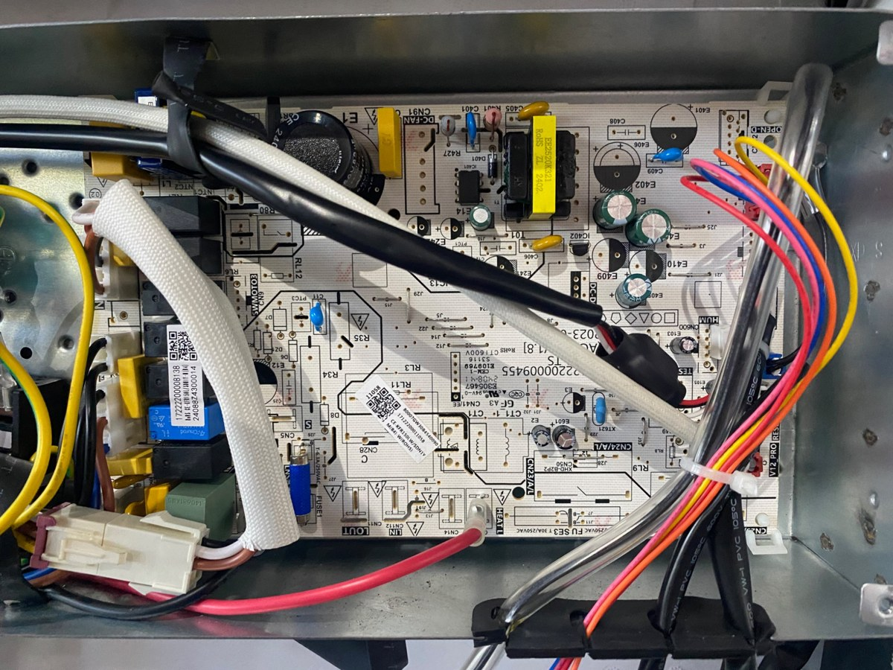
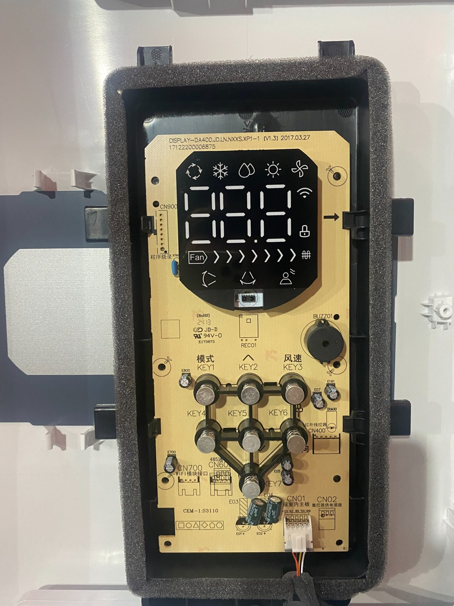
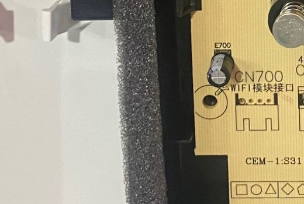
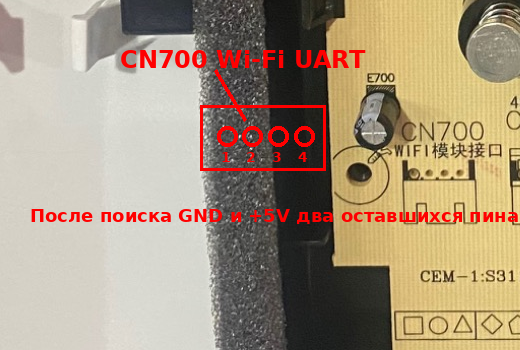
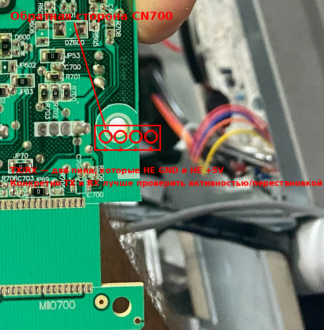
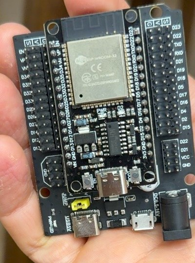
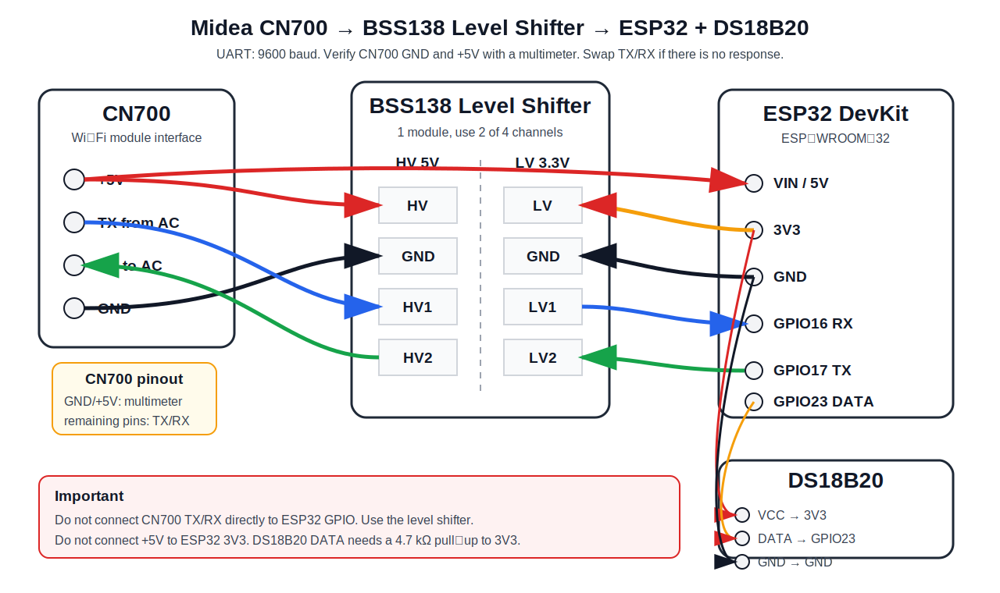
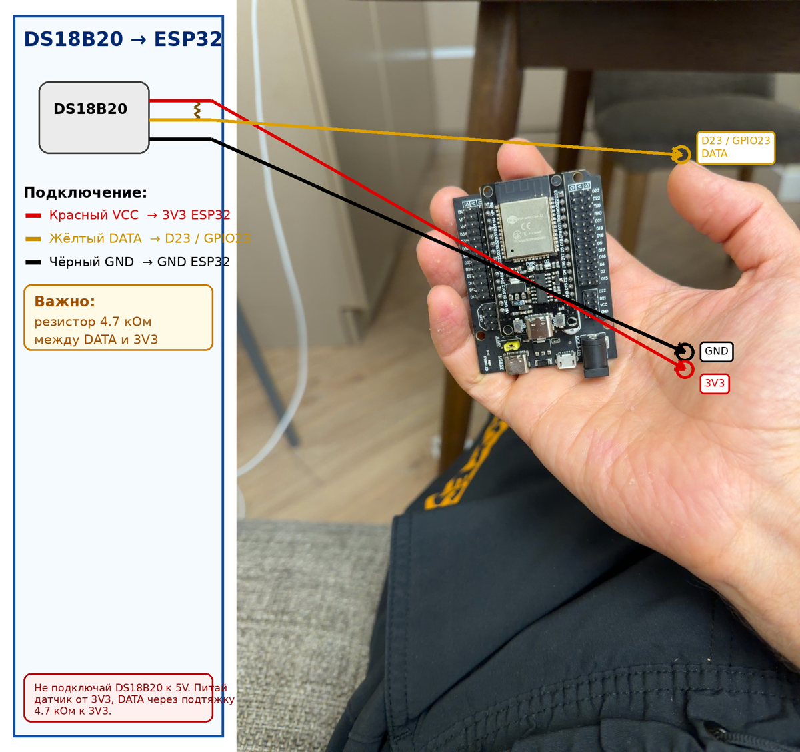

# Midea MFM-60ARN1-R -> ESPHome -> Home Assistant

[](https://esphome.io/components/climate/midea/)
[](https://www.home-assistant.io/)
[](LICENSE)

Local Home Assistant integration for the **Midea MFM-60ARN1-R** floor-standing/column air conditioner through the built-in **CN700 Wi-Fi module interface** on the display board.

Russian version: [README.ru.md](README.ru.md).

This project uses:

- **ESP32 DevKit / ESP-WROOM-32**
- **BSS138 4-channel bidirectional 5V <-> 3.3V level shifter**
- **ESPHome Midea UART climate**
- **DS18B20** as an additional external temperature sensor
- Home Assistant automations for minimum temperature limiting, louver control, and schedules

> Warning: this project requires opening and wiring an air conditioner. Dangerous mains voltage is present inside the unit. Disconnect power before opening the air conditioner. If you are not comfortable working with electronics and mains-powered equipment, ask a qualified technician to do the wiring.

---

## Project Layout

```text
esphome/midea-air.yaml                         # ESPHome configuration for ESP32
esphome/secrets.example.yaml                   # example secrets.yaml without real secrets
home-assistant/automations/                    # Home Assistant automation examples
docs/images/                                   # board photos, component photos, and wiring diagram
```

---

## Compatibility

Tested with:

| Component | Value |
|---|---|
| Indoor unit | Midea MFM-60ARN1-R |
| Main board | 2023000945S |
| Display board | DISPLAY-DA400-JD1D.N.NXXS.XP1-1 v1.3 |
| Wi-Fi connector | CN700 |
| UART speed | 9600 baud |
| ESP board | ESP32 DevKit / ESP-WROOM-32 |
| ESPHome framework | Arduino |
| Temperature sensor | DS18B20, GPIO23 |

ESPHome `midea` requires `9600 baud` UART. The Midea hardware interface usually uses **5V logic levels**, so a level shifter is required between CN700 and ESP32.

Official ESPHome documentation:
https://esphome.io/components/climate/midea/

---

## Board Photos

### Main board



### Display board



### CN700 Wi-Fi module interface







---

## Bill of Materials

| Part | Quantity | Notes |
|---|---:|---|
| ESP32 DevKit / ESP-WROOM-32 | 1 | Standard ESP32 board |
| BSS138 4-channel level shifter | 1 | Only 2 channels are required |
| DS18B20 | 1 | Waterproof metal-probe version is recommended |
| 4.7 kOhm resistor | 1 | Between DS18B20 DATA and 3V3 |
| Dupont/JST wires | as needed | For CN700 wiring |
| Heat shrink / insulation | as needed | For safer installation |

### ESP32



### BSS138 level shifter


---

## Wiring



### CN700 -> BSS138 -> ESP32

> Some CN700 connectors may not have pin labels. First identify **GND** and **+5V** with a multimeter. The two remaining pins are TX/RX. If communication does not work, swap only TX and RX.

| CN700 / air conditioner | Level shifter | ESP32 |
|---|---|---|
| +5V | HV | VIN / 5V ESP32 |
| GND | GND | GND ESP32 |
| Air conditioner TX | HV1 -> LV1 | GPIO16 / RX ESP32 |
| Air conditioner RX | HV2 <- LV2 | GPIO17 / TX ESP32 |
| - | LV | 3V3 ESP32 |

Important:

- **Do not connect CN700 +5V to ESP32 3V3.**
- **Do not connect CN700 TX/RX directly to ESP32 GPIO pins.**
- When flashing the ESP32 over USB, temporarily disconnect `CN700 +5V -> ESP32 VIN/5V` to avoid powering the board from two sources at the same time.
- `CN900 485` on the display board is not used in this project.

---

## DS18B20



DS18B20 wiring:

| DS18B20 | ESP32 |
|---|---|
| VCC / red | 3V3 |
| DATA / yellow | GPIO23 / D23 |
| GND / black | GND |

Place a **4.7 kOhm** resistor between **DATA** and **3V3**.

ESPHome `dallas_temp` requires a configured `one_wire` bus:
https://esphome.io/components/sensor/dallas_temp/
https://esphome.io/components/one_wire/

---

## ESPHome

Firmware file:

```text
esphome/midea-air.yaml
```

Before flashing or publishing a derivative project, create `secrets.yaml` from:

```text
esphome/secrets.example.yaml
```

Do not commit your real `secrets.yaml`.

`midea_air_fallback_password` in `secrets.example.yaml` is only an example ESPHome fallback hotspot password. Replace it before real use.

### Main Pins

| Purpose | ESP32 |
|---|---|
| Midea RX | GPIO16 |
| Midea TX | GPIO17 |
| DS18B20 DATA | GPIO23 |

### DS18B20 Address

The example uses this sensor address:

```yaml
address: 0xa000000035f59628
```

If your DS18B20 has a different address, remove the `address` line, flash ESPHome, and check the detected address in logs.

---

## Home Assistant Entity IDs

The examples use:

```text
climate.midea_air_midea_air
button.midea_air_midea_air_power_toggle
```

Your entity IDs may differ. Check them in:

```text
Settings -> Devices & services -> ESPHome -> Midea AIR -> Entities
```

---

## Automation Examples

Files are in:

```text
home-assistant/automations/
```

### 1. Minimum Temperature 22°C

If someone sets 17-21°C on the air conditioner's panel, Home Assistant sets it back to 22°C.

```text
home-assistant/automations/01-min-temperature-22.yaml
```

### 2. Louver Control After Start

After the air conditioner turns on:

1. Sets fan speed to AUTO.
2. Enables vertical swing for 12 seconds.
3. Stops vertical swing.
4. Enables horizontal swing.

```text
home-assistant/automations/02-louver-on-start.yaml
```

### 3. Turn Off at 20:00

Turns the air conditioner off at 20:00 if it is on and has been running for more than 1 minute.

```text
home-assistant/automations/03-turn-off-20-00.yaml
```

### 4. Turn On at 08:15

Example: turn on at 08:15 if the room temperature is above 22°C and the air conditioner has been off for more than 3 minutes.

```text
home-assistant/automations/04-turn-on-08-15-example.yaml
```

---

## Post-Flash Checklist

1. Open ESPHome logs.
2. Confirm that the device connected to Wi-Fi.
3. Confirm that Home Assistant added the ESPHome device.
4. Check that a `climate` entity exists.
5. Check the DS18B20 temperature sensor.
6. If the `climate` entity does not respond:
   - check GND;
   - check HV/LV level shifter wiring;
   - swap only TX/RX;
   - confirm that UART `baud_rate` is `9600`.

---

## Troubleshooting

### ESP32 is on Wi-Fi, but the air conditioner does not respond

Likely causes:

- TX/RX are swapped;
- there is no shared GND;
- TX/RX are connected without a level shifter;
- HV/LV sides of the level shifter are swapped;
- ESP32 power is not connected to VIN/5V;
- CN700 pinout was identified incorrectly.

### DS18B20 is not detected

Check:

- 4.7 kOhm resistor between DATA and 3V3;
- DATA is connected to GPIO23;
- the sensor is powered from 3V3;
- GND is shared.

### `fan_mode: auto` does not work

Open Home Assistant:

```text
Developer Tools -> States -> climate.midea_air_midea_air
```

Check the `fan_modes` attribute. Some installations may expose `Auto` instead of `auto`.

---

## Security

Do not publish:

- Wi-Fi SSID/password if the network is private;
- ESPHome API encryption key;
- OTA password;
- real Home Assistant `device_id`;
- photos with serial numbers if you do not want them public.

---

## Disclaimer

This is a DIY integration. Use at your own risk. The author is not responsible for damage to the air conditioner, ESP32, electrical system, or property.

---

## License

MIT License. See [LICENSE](LICENSE).
